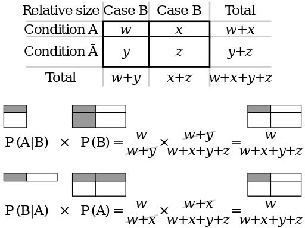

```{r setup, include=FALSE}
knitr::opts_chunk$set(message = FALSE, warning = FALSE, echo = FALSE, comment = "")
library(tidyverse)
theme_set(theme_bw())
```

<style>
.parallax {
    /* The image used */
    background-image: url("15_stat.jpg");
    
    /* Set a specific height */
    min-height: 420px; 

    /* Create the parallax scrolling effect */
    background-attachment: fixed;
    background-position: center;
    background-repeat: no-repeat;
    background-size: auto;
}
</style>

<div class="parallax"></div>

### 1. Probability destribution

* A probability value must be nonnegative. 
* The sum of the probabilities across all events in the entire sample space must be 1. 
* For any two mutually exclusive events, the probability that one or the other occurs is the sum of their individual probabilities.

#### Discrete case: 
$$p(⚀) + p(⚁) + p(⚂) + p(⚃) + p(⚄) + p(⚅) = \sum_{i = 0}^{n} p(x_i) = 1$$

#### Continuouse case:

```{r}
set.seed(42)
data.frame(value = rnorm(100, 100, 20)) %>% 
  ggplot(aes(value)) +
  geom_density(fill = "lightblue")+
  labs(x="", y = "")+
  xlim(20, 180)
```
$$ = \int p(x)dx = 1$$

<div class="parallax"></div>

### 2. Two-way destribution

#### Joint probability
$$p(A, B) = p(B, A)$$

#### Conditional probability
$$p(B|A) = p(A, B)/P(A)$$

#### Discrete case:
```{r}
library(vcd)
mosaic(HairEyeColor[,,1]+HairEyeColor[,,2], shade=TRUE, legend=TRUE)
d <- round(addmargins(prop.table(HairEyeColor[,,1]+HairEyeColor[,,2])), 2)
as.data.frame(d) %>% 
  spread(Eye, Freq)
```

* _joint probability_: probability of having blue eyesand blond hair:
$$p(Hair = Blond, Eye = Blue) = p(Eye = Blue, Hair = Blond) = 0.16$$
* _conditional probability_: probability of having blond hair, if eyes are blue:
$$p(Hair = Blond|Eye = Blue) = \frac{p(Eye = Blue, Hair = Blond)}{\sum_{i=1}^{n} p(Eye = Blue, Hair = x_i)} = \frac{0.16}{0.36} \approx 0.45$$

#### Continuouse case:

```{r, cache=TRUE}
multilingualism <- read_csv("https://github.com/LingConLab/2018_suplementary_for_Gendered_multilingualism_in_highland_Daghestan_story_of_a_loss/blob/master/data.csv?raw=true")
multilingualism %>% 
  distinct(`year of birth`, sex, index) %>% 
  ggplot(aes(`year of birth`,  fill = sex)) +
  geom_density(alpha = 0.4)+
  xlim(1870, 2015)
```

* _joint probability_: probability of having blue eyesand blond hair:
$$p(sex = f, year = 1945) = p(year = 1945, sex = f)$$
* _conditional probability_: probability of having blond hair, if eyes are blue:
$$p(year = 1945|sex = f) = \frac{p(sex = f, year = 1945)}{\int p(sex = f, year = x)dx}$$

<div class="parallax"></div>

### 3. Bayes rule

$$p(A|B) = \frac{p(A, B)}{p(B)}\Rightarrow p(A|B) \times p(B) = p(A, B)$$
$$p(B|A) = \frac{p(B, A)}{p(A)}\Rightarrow p(B|A) \times p(A) = p(B, A)$$
$$p(A|B) \times p(B) = p(B|A) \times p(A)$$
$$p(A|B) = \frac{p(B|A)p(A)}{p(B)}$$

#### Discrete case:
$$p(A|B) = \frac{p(B|A)p(A)}{\sum_{i=1}^{n} p(B, a_i) \times p(a_i)}$$

#### Continuouse case:
$$p(A|B) = \frac{p(B|A)p(A)}{\int p(B, a) \times p(a)da}$$

* what is happening in numerator: 


* what is happening during the division: 

$$\frac{w}{w+x+y+z}:\frac{w+x}{w+x+y+z} = \frac{w}{w+x}$$

<div class="parallax"></div>

### 4. Bayes inference

* p(θ) --- parametor values
* p(Data) --- data values

$$p(θ|Data) = \frac{p(Data|θ)\times p(θ)}{p(Data)}$$

* p(θ|Data) --- posterior
* p(Data|θ) --- likelihood, conjugate prior
* p(θ) --- prior
* p(Data) --- data

Bayes’ rule gets us from a prior belief, p(θ), to a posterior belief, p(θ|D), when we take into account some data D. Now suppose we observe some more data, which we’ll denote D'. We can then update our beliefs again, from p(θ|D) to p(θ|D', D). Does our final belief depend on whether we update with D first and D' second, or update with D' first and D second?

$$p(θ|Data, Data') = p(θ|Data', Data)$$

So for correct modeling we need to know destribution family and conjugate prior:

```{r}
data_frame(likelihood = c("Bernulli", "Multinomial", "...", "Normal with known variance", "Uniform","..."),
           `conjugate prior distribution` = c("Beta", "Dirichlet", "...", "Normal", "Pareto", "..."))
```

<div class="parallax"></div>

### 5. Binomial and Beta destributions

$$P(k | n, θ) = \frac{n!}{k!(n-k)!} \times θ^k \times (1-θ)^{n-k} =  {n \choose k} \times θ^k \times (1-θ)^{n-k}$$
$$ 0 \leq θ \leq 1; n, k > 0$$

```{r}
probabilities <- c(0.23, 0.33, 0.69)
density <- c(dbinom(x = 1:83, size = 83, prob = probabilities[1]),
             dbinom(x = 1:83, size = 83, prob = probabilities[2]),
             dbinom(x = 1:83, size = 83, prob = probabilities[3]))
params <- rep(paste("n = 83, p =", probabilities), each = 83)
id <- rep(1:83, 3)
binomials <- data_frame(density, params, id)

binomials %>% 
  ggplot(aes(id, density, fill = params))+
  geom_polygon(alpha = 0.8)+
  labs(title = "PDF for three binomial distributions")+
  theme_bw()
```

$$P(x; α, β) = \frac{x^{α-1}\times (1-x)^{β-1}}{B(α, β)}; 0 \leq x \leq 1; α, β > 0$$
Beta function:
$$Β(α, β) = \frac{Γ(α)\times Γ(β)}{Γ(α+β)} = \frac{(α-1)!(β-1)!}{(α+β-1)!} $$

```{r}
x <- seq(0, 1, length = 100)
alpha <- c(23, 33, 69)
beta <- 83-alpha
density <- c(dbeta(x, shape1 = alpha[1], shape2 = beta[1]),
             dbeta(x, shape1 = alpha[2], shape2 = beta[2]),
             dbeta(x, shape1 = alpha[3], shape2 = beta[3]))
params <- rep(paste("α =", alpha, ", β =", beta), each = 100)
betas <- data_frame(density, params, id = rep(x, 3))

betas %>% 
  ggplot(aes(id, density, fill = params))+
  geom_polygon(alpha = 0.8)+
  labs(title = "PDF for three beta destributions")+
  theme_bw()
```

```{r, echo = TRUE, eval= FALSE}
shiny::runGitHub("agricolamz/beta_distribution_shiny") 
```

<div class="parallax"></div>

### 6. Binomial example

In corpus based frequency dictionary noun *не* has frequency 0.05389. In some text (61981 words) this preposition appears 2540 times. How does it change our prior knoledge?

* p(θ) --- prior is a Beta destribution
* p(Data|θ) --- conjugate prior is a Binomial destribution
* p(θ|Data) --- posterior is a Beta destribution
* p(Data) --- ... we don't need it since numerator is Beta destribution

* Alpha and beta for prior destribution
$$\mu = \frac{\alpha}{\alpha+\beta} \Rightarrow \alpha = \mu \times (\alpha+\beta) = 6198 \times 0.05389 \approx  3330.156$$
$$\beta = 6198 - 3340.156 = 2857.844$$

* Alpha and beta for posterior destribution
$$\alpha_{posterior} = \alpha_{prior} + \# success = 3340.156 + 2540 $$
$$\beta_{posterior} = \beta_{prior} + \# failure = 2857.844 + 6198 - 2540$$

```{r}
mu_prior <-  0.05389
overall <- 6198
alpha_data <- 2540
alpha_prior <-overall*mu_prior
beta_prior <- overall - alpha_prior
beta_data <- overall - alpha_data
alpha_post <- alpha_prior + alpha_data
beta_post <- beta_prior + beta_data
x <- seq(0, 1, length = 100)
data_frame(p = rep(x, 3),
           density = c(dbeta(x, alpha_prior, beta_prior),
                       dbeta(x, alpha_data, beta_data),
                       dbeta(x, alpha_post, beta_post)),
           type = rep(c("prior", "likelihood", "posterior"), each = 100))%>% 
  ggplot(aes(x = p, y = density, color = type))+
  geom_line()
```
<div class="parallax"></div>

### 7. How stop be afraid of choosing a prior?
* Prior is the way of incorporating previous knowledge.
* Prior is more scintific way of thinking.
* If you are really scared you coud choose non-informative prior.
* ... sometimes you have a trick --- Empirical Bayes Estimation.

#### Empirical Bayes estimation
Then we could calculate proportion of "не" in each of them. After that it is possible to approximate a Beta destribution from the destribution of "не" proportions from different novels and use it as a prior. What we will get is a shrinked mean. The true outliers will be vissible then.

<div class="parallax"></div>
